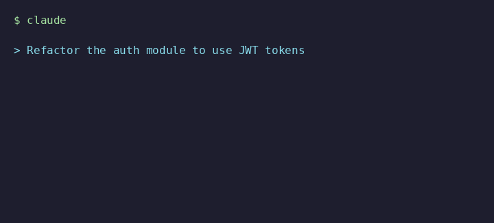

# Frinkiac Thinking GIF — Claude Code Hook

Replace Claude Code's notification beep with a random **Simpsons screencap + quote** from [Frinkiac](https://frinkiac.com) displayed right in your terminal.



With an image renderer like `chafa` installed, you get the actual Simpsons screenshot/GIF rendered as terminal art. Without one, you still get the quote in a styled text frame (as shown above).

## How It Works

Claude Code has a **hooks system** — shell commands triggered by lifecycle events. This project hooks into the **`Notification`** event, which fires whenever Claude Code would normally beep to get your attention (waiting for input, permission prompts, thinking pauses, etc.).

Instead of a beep, the hook:

1. Calls the [Frinkiac API](https://frinkiac.com/api/random) for a random Simpsons moment
2. Fetches the subtitle/caption for that scene
3. Generates a captioned GIF URL (text burned into the image)
4. Renders it in your terminal using the best available renderer — from full-color images (`chafa`/`timg`/`viu`) to ASCII art (`jp2a`/Python+Pillow) to a styled text quote

## Quick Start

```bash
# Clone this repo
git clone <this-repo-url>
cd cc_thinking_frinkac_gif

# Run the installer
./install.sh
```

The installer will:
- Check for required dependencies (`curl`, `jq`)
- Recommend an image renderer if you don't have one
- Ask whether to install globally or per-project
- Write the hook config to your Claude Code settings

## Manual Setup

If you prefer to set it up yourself, add this to `~/.claude/settings.json` (global) or `.claude/settings.json` (per-project):

```json
{
  "hooks": {
    "Notification": [
      {
        "matcher": "",
        "hooks": [
          {
            "type": "command",
            "command": "/absolute/path/to/hooks/frinkiac-thinking.sh",
            "timeout": 15
          }
        ]
      }
    ]
  }
}
```

## Dependencies

### Required
- `curl` — fetch from Frinkiac API
- `jq` — parse JSON responses

### Optional (for image display)
Pick one terminal image renderer for the full visual experience. The hook tries them in priority order and uses the first one found:

| Priority | Tool | Install | Notes |
|----------|------|---------|-------|
| 1 | **chafa** (recommended) | `brew install chafa` / `apt install chafa` | Best quality, wide terminal support |
| 2 | **timg** | `brew install timg` / `apt install timg` | Good alternative |
| 3 | **viu** | `cargo install viu` | Rust-based, fast |
| 4 | **catimg** | `brew install catimg` / `apt install catimg` | Simple, lightweight |
| 5 | **img2sixel** | `brew install libsixel` / `apt install libsixel-bin` | Native Sixel protocol (foot, WezTerm, mlterm) |
| 6 | **jp2a** | `brew install jp2a` / `apt install jp2a` | ASCII art from the actual scene screenshot! |
| 7 | **ascii-image-converter** | `go install github.com/TheZoraworker/ascii-image-converter@latest` | Full-color ASCII art |
| 8 | **Python + Pillow** | `pip install Pillow` | Auto-detected fallback using block characters |

Without any image renderer, you'll still see the Simpsons quote in a styled ASCII text frame with a mini Homer.

## Testing

Run the hook script directly to see it in action:

```bash
./hooks/frinkiac-thinking.sh
```

## How the Frinkiac API Works

The hook uses these (undocumented) Frinkiac endpoints:

| Endpoint | Purpose |
|----------|---------|
| `/api/random` | Get a random episode + timestamp |
| `/api/caption?e=EPISODE&t=TIMESTAMP` | Get subtitles for that moment |
| `/img/EPISODE/TIMESTAMP.jpg` | Still screenshot |
| `/gif/EPISODE/START/END.gif?b64lines=...` | Animated GIF with burned-in caption |

## Uninstall

Remove the `Notification` hook entry from your Claude Code settings file:
- Global: `~/.claude/settings.json`
- Project: `.claude/settings.json` or `.claude/settings.local.json`

## License

MIT
